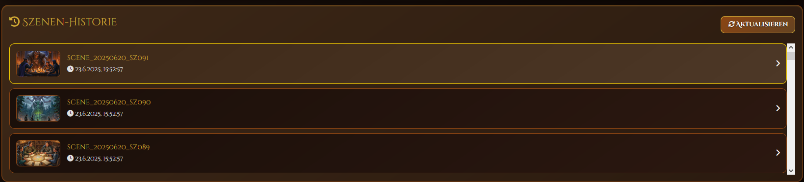

<div align="center">


# Dungeons and Dragons Scene Visualizer

An automated system for generating fantasy illustrations from D&D session recordings using AI-powered speech processing and image generation.

</div>

## 🎮 Epic UI Showcase

Transform your D&D adventures into stunning visual masterpieces with our intuitive web interface! Experience the magic of AI-powered scene generation through these captivating features:

### 🎙️ **Audio Recording Studio**

*Audio capture with device selection and real-time monitoring. Record single clips or continuous D&D sessions with professional-grade quality.*

### 📝 **Intelligent Transcription Engine**  

*Witness your spoken words transform into precise transcripts using cutting-edge Whisper AI technology with German language optimization.*

### 📚 **Comprehensive Transcript Library**

*Organize and access all your D&D session transcripts in a beautifully designed, searchable interface with metadata and processing status.*

### 🔍 **Advanced Transcript Viewer**

*Dive deep into your transcripts with timestamped segments, confidence scores, and detailed linguistic analysis - every word perfectly captured.*

### 🎨 **Breathtaking Scene Generation**

*Watch as AI transforms your narrative into stunning D&D-style illustrations using FLUX.1-dev with specialized fantasy LoRA training.*

### 📖 **Rich Scene Metadata**

*Every generated scene comes with detailed metadata, LLM-generated descriptions, and full traceability from audio to final artwork.*

### 🏛️ **Cinematic Scene Gallery**

*Browse your entire collection of generated scenes in a visually stunning gallery with timeline view, metadata display, and cinema mode.*

---

**Ready to transform your D&D sessions into epic visual stories?** Follow the installation guide below! ⬇️

## 🎨 **Epic D&D Scene Gallery** 
### *AI-Generated Fantasy Masterpieces from Real Sessions*

Behold the power of AI-driven storytelling! These stunning scenes were automatically generated from actual D&D session recordings. Experience our cinematic slideshow of epic adventures:

---

<div align="center">

## 🎬 **Cinematic Adventure Slideshow**

**🎲 Scene 1: Bloody Fight**


---

**⚡ Scene 2: Huge Enemy**


---

**🗡️ Scene 3: Recovery**


---

**🌟 Scene 4: Divine Intervention**


---

**🔮 Scene 5: Arcane Mysteries**


---

**🛡️ Scene 6: Pinch Riot**


---

**🌙 Scene 7: Shadows and Secrets**


---

**⚔️ Scene 8: Epic Confrontation**


---

**🏰 Scene 9: Ancient Grounds**

---

**👑 Scene 10: Most Wanted**


</div>

---

> **🎲 Every single scene above was automatically generated from audio recordings of actual D&D sessions!** 
> 
> *Experience the magic yourself - transform your adventures into legendary artwork with just one click.*

## 🌐 Language Support

**Current Status**: This system is currently optimized for **German language** D&D sessions. The speech recognition, LLM prompts, and scene analysis are configured for German input.

**Contributing**: We welcome contributions to add support for additional languages! The system is designed to be extensible - you can help by:
- Adding language-specific prompts in `scene_visualizer_runner.py`
- Configuring Whisper for other languages in `web/main.py`
- Translating the web interface
- Testing with non-German D&D sessions

See the [Contributing](#-contributing) section for more details on how to help expand language support.

## 🎯 System Overview

The D&D Scene Visualizer System consists of two main components working seamlessly together:

1. **Web Interface** (`main.py`) - Audio recording, transcription and presentation
2. **Scene Visualizer** (`scene_visualizer_runner.py`) - Automatic scene analysis and image generation

### 🔄 Workflow

```mermaid
graph TD
    A[🎙️ Audio Recording<br/>Web Interface] --> B[📝 Whisper Transcription<br/>faster-whisper]
    B --> C[💾 Transcript Storage<br/>web/transkripte/]
    C --> D[👁️ File Monitoring<br/>Watchdog]
    D --> E[🤖 Scene Analysis<br/>Ollama + deepseek-r1:8b]
    E --> F[🎨 Image Generation<br/>FLUX.1-dev + D&D LoRA]
    F --> G[🖼️ Scene Display<br/>web/scene/]
    G --> H[🌐 Web Gallery<br/>Browser Interface]
```



## 🏗️ System Architecture

### Core Services

| Service | Description | Port/Path |
|---------|-------------|-----------|
| **Web Interface** | FastAPI Server for Audio Recording and Scene Display | `:8000` |
| **Ollama LLM** | DeepSeek-R1:8b for Scene Analysis | `:11434` |
| **FLUX Image Service** | FLUX.1-dev + D&D LoRA for Image Generation | `:5555` |
| **Scene Visualizer** | File Monitoring and Workflow Orchestration | Background Process |

### Directory Structure

```
dnd-visualizer/
├── 🌐 Web Interface
│   ├── web/main.py                    # FastAPI Server
│   ├── web/templates/index.html       # Web Frontend
│   ├── web/static/js/audio-recorder.js # Client-side Audio Recording
│   ├── web/transkripte/              # 📝 Input: Transcripts
│   └── web/scene/                    # 🖼️ Output: Generated Scenes
│
├── 🎨 Scene Generation
│   ├── scene_visualizer_runner.py    # Main Orchestrator
│   ├── img_gen_service.py            # FLUX.1-dev Service
│   ├── img_gen.py                    # Image Generation Client
│   └── parse_scene_transkript.py     # Transcript Parser
│
├── 🤖 LLM Integration  
│   ├── run_ollama.sh                 # Ollama Startup
│   └── ollama/                       # Local Ollama Installation
│
├── ⚙️ Configuration
│   ├── scene_config.json            # Scene Visualizer Config
│   ├── img_gen_service.json         # Image Service Config
│   └── requirements.txt             # Python Dependencies
│
└── 🚀 Startup Scripts
    ├── start_scene_system.sh         # Scene System Starter
    └── web/start_server.sh           # Web Interface Starter
```

## 🛠️ Installation

### 1. System Requirements

```bash
# Python 3.8+
python3 --version

# NVIDIA GPU (recommended for FLUX.1-dev)
nvidia-smi

# CUDA Toolkit (for GPU acceleration)
nvcc --version
```

### 2. Python Dependencies

```bash
pip install -r requirements.txt
```

**Important Dependencies:**
- `faster-whisper>=0.9.0` - Speech Recognition
- `ollama>=0.3.3` - LLM Integration  
- `diffusers>=0.30.0` - FLUX.1-dev Image Generation
- `torch>=2.0.0` - CUDA Support
- `fastapi` + `uvicorn` - Web Interface
- `watchdog>=4.0.0` - File Monitoring

### 3. Ollama Setup (Local Installation)

The system includes a local Ollama installation, but you need to download the model:

```bash
# Option 1: Using the included Ollama binary
./ollama/bin/ollama pull deepseek-r1:8b

# Option 2: Install Ollama system-wide (alternative)
curl -fsSL https://ollama.ai/install.sh | sh
ollama pull deepseek-r1:8b

# Verify installation
./ollama/bin/ollama list
```

**Ollama Configuration:**
The system is configured to use the local Ollama instance with these settings:
- **Model**: `deepseek-r1:8b` - Optimized for reasoning and analysis
- **Host**: `localhost:11434`
- **Keep Alive**: 240 minutes (4 hours) 
- **Models Directory**: `./ollama/models`

### 4. Hugging Face Token (for FLUX.1-dev)

```bash
# Set token in environment variable:
export HF_TOKEN="your_huggingface_token_here"
```

### 5. D&D Style FLUX Model

This system uses the specialized D&D illustration model **[SouthbayJay/dnd-style-flux](https://huggingface.co/SouthbayJay/dnd-style-flux)**:

- **Base Model**: FLUX.1-dev from Black Forest Labs
- **LoRA**: D&D Style trained on vast dataset of D&D illustrations
- **Trigger Word**: `dndstyle` (automatically used in prompts)
- **License**: Bespoke LoRA Trained License

The model automatically downloads when first used. Example generated prompts:
- `dndstyle illustration of a female knight with sword and helmet`
- `dndstyle illustration of a fire breathing dragon, castle in background`
- `dndstyle illustration of an elfin thief`

## 🚀 Starting the System

### Method 1: Complete Start (Recommended)

```bash
# Start Scene System (Ollama + FLUX + Scene Visualizer)
./start_scene_system.sh

# In separate terminal: Web Interface
cd web/
python main.py
```

### Method 2: Individual Services

```bash
# 1. Start Ollama
./run_ollama.sh

# 2. Start Image Service  
python img_gen_service.py

# 3. Start Scene Visualizer
python scene_visualizer_runner.py

# 4. Start Web Interface
cd web/
python main.py
```

## 📱 Usage

### 1. Audio Recording

1. Open browser: `http://localhost:8000`
2. Select **"Recording"** tab
3. Choose audio device
4. **"Start Recording"** for single recordings
5. **"Continuous Scene Recording"** for automatic D&D session segmentation

### 2. Automatic Processing

The system processes new recordings automatically:

```
📝 Audio → Transcript → 🤖 LLM Analysis → 🎨 Image Generation
```

**Processing Times:**
- Transcription: ~1-3x realtime (hardware dependent)
- LLM Analysis: ~5-15 seconds
- Image Generation: ~30-60 seconds (GPU) / 3-5 minutes (CPU)

### 3. Scene Display

1. Open **"D&D Scenes"** tab
2. Automatic display of newest generated scene
3. **Scene Gallery** for all available scenes
4. **Cinema Mode** for fullscreen presentation

## 🔧 Configuration

### Scene Visualizer (`scene_config.json`)

```json
{
    "transkript_directory": "web/transkripte",
    "scene_directory": "web/scene", 
    "log_level": "INFO",
    "services": {
        "ollama": {
            "model": "deepseek-r1:8b",
            "temperature": 0.7,
            "max_tokens": 1000
        },
        "image_generation": {
            "timeout_seconds": 300
        }
    }
}
```

### Image Service (`img_gen_service.json`)

```json
{
    "host": "127.0.0.1",
    "port": 5555,
    "model_id": "black-forest-labs/FLUX.1-dev",
    "lora_repo": "SouthbayJay/dnd-style-flux", 
    "lora_weight": "dnd_style_flux.safetensors",
    "dtype": "bfloat16",
    "output_dir": "web/scene"
}
```

## 📊 File Formats

### Transcript Format

```
Transcript for: scene_20250620_sz001.wav
Date: 20.06.2025 01:15:57
Language: de
Confidence: 95.2%
Duration: 65.45 seconds
==================================================

FULL TEXT:
[Complete transcribed text]

==================================================

TIMESTAMPED SEGMENTS:
[00:00.34 - 00:06.40] The Dungeon Master describes the dark tavern
[00:08.00 - 00:14.42] A mysterious stranger enters the room
...
```

### Scene Metadata (`*_metadata.json`)

```json
{
    "scene_name": "scene_20250620_sz001",
    "generation_timestamp": "2025-01-20T15:30:00",
    "transcript_file": "scene_20250620_sz001_transkript.txt",
    "szenenbeschreibung": "A dark tavern by candlelight...",
    "dndstyle_prompt": "dndstyle illustration of a dimly lit medieval tavern...",
    "wichtige_elemente": ["Tavern", "Candlelight", "Stranger"],
    "stimmung": "Mysterious and suspenseful",
    "llm_result": { /* Complete LLM response */ },
    "image_file": "scene_20250620_sz001_image.png"
}
```

## 🔍 Monitoring & Debugging

### Log Files

| Log File | Description |
|----------|-------------|
| `scene_runner.log` | Main log of Scene Visualizer |
| `scene_errors.log` | Error-only log of Scene System |
| `img_gen_service.log` | Image Service activities |
| `web/*.log` | Web Interface logs |

### System Status Check

```bash
# Scene Visualizer Status
python check_system_status.py

# Check processes
ps aux | grep -E "(ollama|python.*scene|python.*img_gen)"

# Test service endpoints
curl http://localhost:11434/api/tags  # Ollama
curl http://localhost:8000/api/system-info  # Web Interface
```

### Tracking System

The system uses a JSON-based tracking system:

```bash
# Show tracking status
cat web/transkripte/transkript_tracking.json
```

## 🔧 Troubleshooting

### Common Issues

#### 1. "Image Service could not be started"

```bash
# Check GPU availability
nvidia-smi

# Test CUDA installation
python -c "import torch; print(torch.cuda.is_available())"

# Check logs
tail -f img_gen_service.log
```

#### 2. "Ollama Service not ready"

```bash
# Check Ollama status
curl http://localhost:11434/api/tags

# Check port conflicts
lsof -i :11434

# Start Ollama manually
./ollama/bin/ollama serve

# Check if model is downloaded
./ollama/bin/ollama list
```

#### 3. "Transcription failed"

```bash
# Install audio codecs
sudo apt-get install ffmpeg

# Test faster-whisper
python -c "from faster_whisper import WhisperModel; print('OK')"
```

#### 4. "No new scenes detected"

```bash
# Check file monitoring
ls -la web/transkripte/
cat scene_runner.log | grep "New file"

# Test watchdog system
python -c "from watchdog.observers import Observer; print('OK')"
```

### Performance Optimization

#### GPU Acceleration

```bash
# Optimize CUDA memory
export PYTORCH_CUDA_ALLOC_CONF=max_split_size_mb:512

# Mixed precision (already configured)
# in img_gen_service.json: "dtype": "bfloat16"
```

#### Memory Management

```bash
# Ollama memory settings
export OLLAMA_KEEP_ALIVE=240m  # Keep in memory for 4 hours

# Python memory settings
export PYTHONUNBUFFERED=1
```

## 🎨 Advanced Features

### Cinema Mode

- **Fullscreen scene display** with automatic slideshow
- **Keyboard shortcuts**: Arrow keys for navigation, ESC to exit
- **Auto-hide cursor** after 3 seconds of inactivity

### Continuous Recording

- **Automatic segmentation** into 1-minute scenes
- **Real-time upload** and processing
- **Live monitoring** of processing pipeline

### Scene History

- **Chronological overview** of all generated scenes
- **Metadata display** with LLM analysis
- **Thumbnail preview** for quick navigation

## 🚀 Development & Extension

### Adding New LLM Models

```python
# In scene_config.json:
"ollama": {
    "model": "llama3.2:8b",  # Different model
    "temperature": 0.8
}
```

### Integrating New Image Models

```python
# Modify img_gen_service.json:
"model_id": "stabilityai/stable-diffusion-xl-base-1.0",
"lora_repo": "custom/fantasy-lora"
```

### Custom Prompts

The system supports template-based prompt generation via Ollama's system prompt in `scene_visualizer_runner.py`. All generated prompts automatically include the `dndstyle` trigger word for optimal results with the [SouthbayJay/dnd-style-flux](https://huggingface.co/SouthbayJay/dnd-style-flux) model.

## 📄 API Documentation

### Web Interface APIs

```bash
# System Information
GET /api/system-info

# Audio Upload
POST /api/upload-recording
POST /api/upload-scene

# Transcription Status
GET /api/transcription/{filename}
GET /api/transcriptions

# Scene APIs
GET /api/latest-scene
GET /api/scene/{scene_name}
GET /api/all-scenes
```

### Image Generation API

```bash
# Generate image (JSON over socket)
echo '{"prompt": "dndstyle illustration of a dragon", "file": "dragon.png"}' | nc localhost 5555
```

## 🔐 Security

- **Local processing**: All data remains on the system
- **No cloud dependencies**: Only Hugging Face for model downloads
- **Sandboxed environment**: Services run in isolated processes

## 📋 System Requirements

### Minimum
- **CPU**: 4+ cores
- **RAM**: 8GB (16GB recommended)
- **Storage**: 10GB for models
- **GPU**: Optional (CPU fallback available)

### Recommended
- **CPU**: 8+ cores (e.g., AMD Ryzen 7 / Intel i7)
- **RAM**: 16-32GB
- **GPU**: NVIDIA RTX 3060+ (8GB VRAM)
- **Storage**: SSD with 20GB+ free space

## 🤝 Contributing

The system is modularly built and extension-friendly:

1. **Fork** the repository
2. Create **feature branch**
3. Add **tests**
4. Submit **pull request**

## 📜 License

This project uses various open-source components:
- **FLUX.1-dev**: Under Apache 2.0 License
- **D&D Style LoRA**: Under Bespoke LoRA Trained License
- **Ollama**: MIT License
- **FastAPI**: MIT License

## 🔗 Additional Resources

- [FLUX.1-dev Documentation](https://huggingface.co/black-forest-labs/FLUX.1-dev)
- [D&D Style FLUX LoRA](https://huggingface.co/SouthbayJay/dnd-style-flux)
- [Ollama Documentation](https://ollama.ai/docs)
- [FastAPI Documentation](https://fastapi.tiangolo.com/)

---

**Made with ❤️ for D&D Communities**

*Transform your D&D sessions into epic visual memories!* 